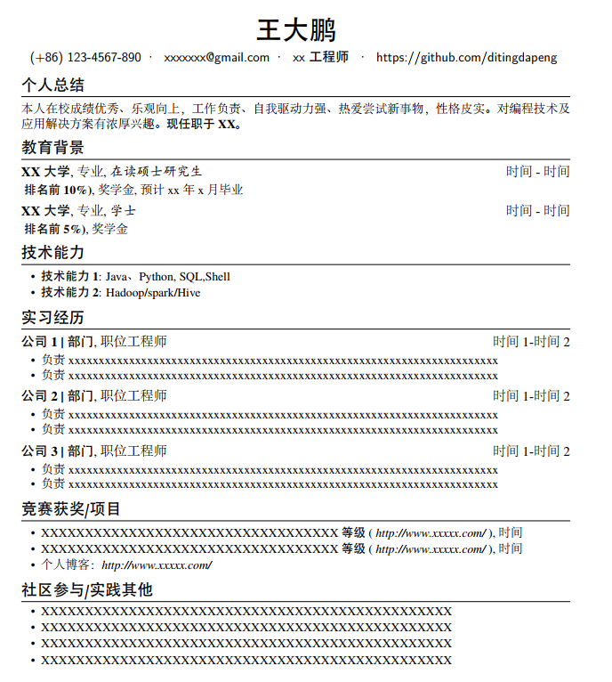

# 个人简历

本项目为 Latex 文件的简历，简历入口为 resume-zh_CN.tex，由Latex编辑器编译后可生成pdf文件。

### 效果输出

## 使用方法

1. latex文件需要编译，因此需要先安装好latex文件。推荐使用Miktex直接进行安装，链接地址：https://miktex.org/
2. 安装完后，可以使用latex编辑器，也可以使用miktex自带的编辑器，通过编辑器编辑过后可以直接编译，打开生成的pdf文件即可。
